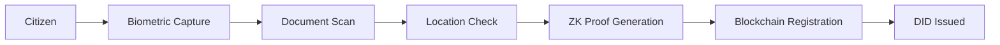
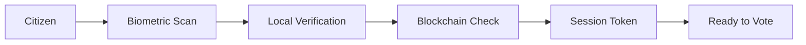
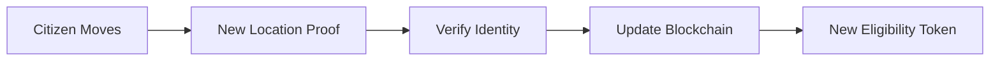

# Shout Aloud Identity Module

## 🔐 Overview

The Shout Aloud Identity Module implements a revolutionary approach to digital identity that ensures **one person = one identity** while maintaining **complete privacy**. Built on W3C DID (Decentralized Identifiers) and VC (Verifiable Credentials) standards with Zero-Knowledge Proofs.

## 🎯 Key Features

### Privacy First
- ✅ **No personal data stored** - Everything processed locally on device
- ✅ **Zero-Knowledge Proofs** - Prove eligibility without revealing identity
- ✅ **Decentralized** - No central authority controls identities
- ✅ **User-owned** - Citizens control their own credentials

### One Person = One Identity
- ✅ **Biometric uniqueness** - Prevents duplicate registrations
- ✅ **Blockchain verification** - Immutable identity registry
- ✅ **Nullifier system** - Mathematical guarantee of uniqueness
- ✅ **No backdoors** - Lost credentials cannot be recovered centrally

### Geographic Eligibility
- ✅ **Municipality-based voting** - Vote only where you live
- ✅ **Automatic scope detection** - Federal, state, or municipal
- ✅ **Privacy-preserving location** - No GPS tracking
- ✅ **Update on move** - Change municipality when relocating

## 🏗️ Architecture

```
┌─────────────────────────────────────────────────────────┐
│                    User Device (Local)                   │
├─────────────────────────────────────────────────────────┤
│  ┌─────────────┐  ┌──────────────┐  ┌───────────────┐  │
│  │  Biometric  │  │   Document   │  │   Location    │  │
│  │  Processor  │  │   Scanner    │  │  Determiner   │  │
│  └──────┬──────┘  └──────┬───────┘  └───────┬───────┘  │
│         │                 │                   │          │
│         └─────────────────┴───────────────────┘          │
│                           │                              │
│                    ┌──────▼──────┐                      │
│                    │  ZK Prover  │                      │
│                    └──────┬──────┘                      │
└───────────────────────────┼─────────────────────────────┘
                           │
                    ┌──────▼──────┐
                    │ Blockchain  │
                    │  Registry   │
                    └─────────────┘
```

## 📦 Module Structure

```
identity/
├── did-vc-identity.ts      # Core DID/VC implementation
├── zk-circuits.circom      # Zero-Knowledge proof circuits
├── identity-integration.ts  # Blockchain & storage integration
├── identity-tests.ts       # Test suite & examples
└── README.md              # This file
```

## 🚀 Quick Start

### Installation

```bash
npm install @shout-aloud/identity

# Required dependencies
npm install ethers@5 ipfs-core orbit-db
npm install @noble/ed25519 @scure/base
npm install snarkjs circomlib
```

### Basic Usage

```typescript
import { IdentityService } from '@shout-aloud/identity';

// Initialize service
const identityService = new IdentityService(
  contractAddress,
  contractABI,
  provider,
  signer
);

await identityService.initialize();

// Register new citizen
const registration = await identityService.registerCitizen(
  biometricData,
  documentData,
  personalData,
  location
);

if (registration.success) {
  console.log('DID:', registration.did);
  console.log('Session:', registration.sessionToken);
}
```

## 🔑 Core Components

### 1. DID Manager
Handles Decentralized Identifiers following W3C standards:

```typescript
const didManager = new DIDManager();
const { did, privateKey, publicKey } = await didManager.generateDID();
// Output: did:shout:polygon:abc123xyz
```

### 2. Verifiable Credentials Manager
Issues and verifies geographic eligibility credentials:

```typescript
const vcManager = new VCManager();
const credential = await vcManager.issueGeographicCredential(
  subjectDID,
  municipalityCode,
  stateCode,
  countryCode,
  issuerDID,
  issuerPrivateKey
);
```

### 3. Zero-Knowledge Identity Verifier
Ensures privacy while preventing duplicates:

```typescript
const zkVerifier = new ZKIdentityVerifier();
const { commitment, nullifier, secret } = 
  await zkVerifier.generateIdentityCommitment(
    biometricHash,
    documentNumber,
    birthDate
  );
```

### 4. Geographic Token Manager
Issues time-bound eligibility tokens for voting:

```typescript
const geoTokenManager = new GeographicTokenManager();
const { token, credential } = await geoTokenManager.issueEligibilityToken(
  userDID,
  identityProof,
  municipalityCode,
  issuerDID,
  issuerPrivateKey
);
```

## 🛡️ Security Model

### Threat Protection

| Threat | Protection |
|--------|------------|
| Identity theft | Biometric verification + ZK proofs |
| Duplicate registration | Nullifier system on blockchain |
| Location spoofing | Proof of residence required |
| Data breaches | No personal data stored |
| Government surveillance | Zero-knowledge architecture |
| Credential loss | User-controlled backup |

### Privacy Guarantees

1. **Biometric data** - Never leaves device
2. **Document numbers** - Converted to hash
3. **Exact location** - Only municipality stored
4. **Personal details** - Zero-knowledge proofs
5. **Voting history** - Anonymous on blockchain

## 🌐 Geographic Eligibility

The system supports three voting scopes:

### Municipal (Local)
- User must live in exact municipality
- Most restrictive eligibility
- Example: City council decisions

### State (Regional) 
- User must live in same state
- Medium eligibility scope
- Example: State laws

### Federal (National)
- User must be citizen of country
- Broadest eligibility
- Example: Constitutional amendments

## 🔄 Identity Lifecycle

### 1. Registration


### 2. Authentication


### 3. Municipality Update


## 📊 Performance Metrics

| Operation | Time | Location | Resource Usage |
|-----------|------|----------|----------------|
| DID Generation | < 50ms | Device | Minimal |
| Biometric Hash | < 100ms | Device | Low CPU |
| ZK Proof | < 2s | Device | Medium CPU |
| Blockchain Write | ~15s | Network | Gas fees |
| Authentication | < 3s | Device | Low |

## 🚨 Important Considerations

### No Backdoors
- **Lost credentials = Lost access**
- No "forgot password" option
- User sovereignty means user responsibility
- Backup recovery phrase is critical

### One Identity Forever
- Cannot create multiple identities
- Cannot "delete and restart"
- Identity follows you for life
- This ensures fairness and prevents fraud

### Privacy vs Accountability
- Votes are anonymous but verifiable
- Cannot link votes to identity
- Can verify you voted
- Can verify vote was counted

## 🛠️ Development

### Building ZK Circuits

```bash
# Compile circuits
circom circuits/identity.circom --r1cs --wasm --sym

# Generate proving key
snarkjs groth16 setup identity.r1cs pot14_final.ptau identity_0000.zkey

# Contribute to ceremony
snarkjs zkey contribute identity_0000.zkey identity_final.zkey

# Export verification key
snarkjs zkey export verificationkey identity_final.zkey verification_key.json
```

### Testing

```bash
# Run test suite
npm test

# Run specific test
npm test -- --grep "duplicate prevention"

# Performance benchmarks
npm run benchmark
```

## 📄 License

This module is part of Shout Aloud - The voice of the people.
Open source under MIT License.

## 🤝 Contributing

We welcome contributions that enhance privacy and security:
1. Fork the repository
2. Create feature branch
3. Add tests for new features
4. Ensure all tests pass
5. Submit pull request

## ⚠️ Disclaimer

This system is designed for maximum privacy and security. However:
- Users are responsible for backing up credentials
- Lost recovery phrases cannot be recovered
- The system has no backdoors by design
- This is a feature, not a bug

---

*"One person, one voice, one vote. Anonymous but accountable. Private but verifiable. This is the future of democracy."*