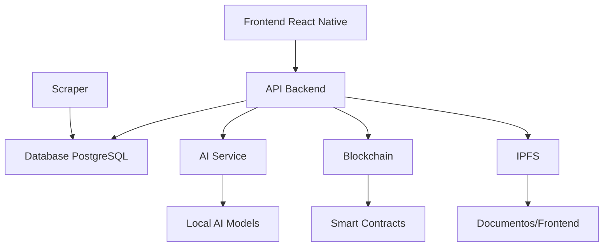

# 🏛️ Shout Aloud - Quick Start Guide

> **Plataforma democrática descentralizada que devuelve el poder a los ciudadanos**

[](LICENSE)
[](https://docker.com)
[](https://github.com/shout-aloud/platform)

## 🚀 Quick Start (5 minutos)

```bash
# 1. Clonar el repositorio
git clone https://github.com/shout-aloud/platform.git
cd platform

# 2. Ejecutar setup automático
make setup

# 3. Iniciar la plataforma
make start

# 4. Abrir en el navegador
open http://localhost:3000
```

**¡Listo!** Ya tienes Shout Aloud ejecutándose localmente.

## 🎯 ¿Qué es Shout Aloud?

Shout Aloud es una plataforma democrática revolucionaria que permite a los ciudadanos:

- ✅ **Votar directamente** en leyes y propuestas gubernamentales
- 🤖 **Análisis IA** de documentos legales en lenguaje ciudadano
- 🔒 **Privacidad total** - identidad verificada sin datos personales
- 🌐 **Descentralizado** - sin dependencias de servidores centralizados
- 📊 **Transparencia** - calificar funcionarios públicos sin comentarios tóxicos

## 🏗️ Arquitectura



### Servicios Incluidos

| Servicio | Puerto | Descripción |
|----------|--------|-------------|
| **Frontend** | 3000 | React Native (web/móvil) |
| **Backend API** | 8000 | FastAPI con documentación |
| **AI Service** | 8001 | Análisis de documentos legales |
| **Blockchain** | 8545 | Hardhat (red local) |
| **IPFS** | 8080 | Almacenamiento descentralizado |
| **Database** | 5432 | PostgreSQL |
| **Redis** | 6379 | Cache y sesiones |
| **Monitoring** | 3001 | Grafana (admin/admin123) |

## 📋 Comandos Útiles

### Gestión de Servicios
```bash
make start          # Iniciar todos los servicios
make stop           # Detener todos los servicios
make restart        # Reiniciar todos los servicios
make status         # Ver estado de servicios
make logs           # Ver logs de todos los servicios
```

### Desarrollo
```bash
make dev            # Modo desarrollo con logs
make dev-build      # Reconstruir y iniciar
make build          # Construir imágenes Docker
make health         # Verificar salud de servicios
```

### Base de Datos
```bash
make db-backup      # Crear backup de la BD
make db-reset       # Resetear BD (¡CUIDADO!)
make shell-db       # Conectar a PostgreSQL
```

### Blockchain
```bash
make blockchain-compile  # Compilar contratos
make blockchain-deploy   # Desplegar contratos
make blockchain-test     # Probar contratos
```

### IPFS
```bash
make ipfs-status    # Estado de IPFS
make ipfs-add FILE=archivo.pdf    # Subir archivo
make ipfs-pin HASH=QmXXX...       # Fijar contenido
```

### AI
```bash
make ai-download-models           # Descargar modelos IA
make ai-analyze TEXT="texto..."   # Analizar texto
```

## 🔧 Configuración

### Variables de Entorno

Edita el archivo `.env` creado automáticamente:

```env
# APIs (opcional para desarrollo)
OPENAI_API_KEY=tu_clave_openai
HUGGINGFACE_API_KEY=tu_token_huggingface

# Blockchain (para producción)
PRIVATE_KEY=tu_clave_privada_ethereum
POLYGON_RPC_URL=https://polygon-rpc.com

# IPFS (para servicios externos)
PINATA_JWT=tu_jwt_pinata
WEB3STORAGE_KEY=tu_clave_web3storage
```

### Configurar tu Ubicación

1. Abre http://localhost:8000/docs
2. Ve a `/auth/register`
3. Usa estos códigos para México:
   - **CDMX**: municipality_code: 9, state_code: 9
   - **Guadalajara**: municipality_code: 39, state_code: 14
   - **Monterrey**: municipality_code: 39, state_code: 19

## 📱 Uso de la Plataforma

### 1. Registro con Identidad Descentralizada

```bash
# Abre la app
open http://localhost:3000

# Sigue el proceso:
# 1. Escaneo facial (local, no se almacena)
# 2. Verificación biométrica
# 3. Generación de DID
# 4. Selección de ubicación
```

### 2. Análisis de Propuestas

La IA analiza automáticamente cada propuesta y te dice:

- **¿Cómo me afecta?** - Impacto personal
- **¿Quién se beneficia?** - Análisis de beneficiarios
- **¿Es justo?** - Evaluación de equidad
- **Recomendación** - SÍ/NO/ABSTENCIÓN con confianza

### 3. Votación Anónima

- Un persona = un voto (garantizado por blockchain)
- Votación completamente anónima
- Resultados verificables por zona
- Sin posibilidad de manipulación

### 4. Calificación de Funcionarios

- Solo etiquetas predefinidas (sin comentarios tóxicos)
- IA sugiere etiquetas basadas en acciones
- Reputación por zona geográfica
- Gráficos de tendencias

## 🧪 Testing

### Datos de Prueba

El sistema incluye datos de ejemplo:

```sql
-- Propuestas de ejemplo
SELECT * FROM proposals;

-- Funcionarios de ejemplo  
SELECT * FROM officials;

-- Tags disponibles
SELECT * FROM tags;
```

### Probar APIs

```bash
# Test backend
curl http://localhost:8000/health

# Test AI
curl -X POST http://localhost:8001/analyze \
  -H "Content-Type: application/json" \
  -d '{"text": "Esta ley aumenta el salario mínimo 20%"}'

# Test blockchain
curl -X POST http://localhost:8545 \
  -H "Content-Type: application/json" \
  -d '{"jsonrpc":"2.0","method":"eth_blockNumber","params":[],"id":1}'
```

## 🐛 Troubleshooting

### Problemas Comunes

**Servicios no inician:**
```bash
# Verificar Docker
docker --version
make check

# Ver logs específicos
make logs-backend
make logs-ai
```

**Puerto ocupado:**
```bash
# Cambiar puertos en docker-compose.yml
# O detener proceso que use el puerto
sudo lsof -ti:8000 | xargs kill -9
```

**Falta de espacio:**
```bash
# Limpiar Docker
make clean
docker system prune -a
```

**Problemas de permisos:**
```bash
# Linux/Mac
sudo chown -R $USER:$USER data/
chmod -R 755 data/
```

### Logs de Debug

```bash
# Ver todos los logs
make logs

# Logs específicos
make logs-backend    # Backend API
make logs-ai         # Servicio IA
make logs-scraper    # Web scraper
make logs-blockchain # Red blockchain
make logs-frontend   # Frontend
```

## 🚀 Producción

### Despliegue Local Completo

```bash
# Compilar para producción
make build

# Desplegar frontend a IPFS
make frontend-deploy

# Configurar dominios descentralizados
# (requiere ENS/Handshake configurados)
```

### Infraestructura Descentralizada

```bash
# Iniciar orquestador descentralizado
python -m infrastructure.decentralized.orchestrator start

# Verificar nodos
python -m infrastructure.decentralized.node_replicator status

# Verificar DNS descentralizado
python -m infrastructure.decentralized.dns_resolver test
```

## 🤝 Contribuir

### Setup de Desarrollo

```bash
# Fork el repositorio
git clone https://github.com/tu-usuario/platform.git

# Crear rama de feature
git checkout -b feature/nueva-funcionalidad

# Hacer cambios y probar
make test

# Commit y push
git commit -m "feat: nueva funcionalidad"
git push origin feature/nueva-funcionalidad

# Crear Pull Request
```

### Estructura del Proyecto

```
platform/
├── backend/           # API FastAPI
├── backend/ai/        # Servicio de IA
├── frontend-mobile/   # App React Native
├── blockchain/        # Smart contracts
├── scraping/          # Web scrapers
├── governance/        # Sistema de calificaciones
├── infrastructure/    # Infraestructura descentralizada
├── config/           # Configuraciones
├── scripts/          # Scripts de utilidad
└── docs/             # Documentación
```

## 📚 Documentación Completa

- [📖 Documentación API](http://localhost:8000/docs)
- [🤖 Documentación IA](http://localhost:8001/docs)
- [⛓️ Documentación Blockchain](./blockchain/README.md)
- [🏗️ Arquitectura](./docs/architecture.md)
- [🔐 Seguridad](./docs/security.md)
- [🌐 Infraestructura](./docs/infrastructure.md)

## 🆘 Soporte

- **Issues**: [GitHub Issues](https://github.com/shout-aloud/platform/issues)
- **Discord**: [Comunidad](https://discord.gg/shoutaloud)
- **Email**: support@shout-aloud.eth
- **Matrix**: `#shout-aloud:matrix.org`

## 📄 Licencia

MIT License - ver [LICENSE](LICENSE) para detalles.

---

**🎯 Misión**: Devolver el poder democrático a los ciudadanos mediante tecnología descentralizada, transparente y resistente a la censura.

**¿Preguntas?** ¡Abre un issue o únete a nuestra comunidad!